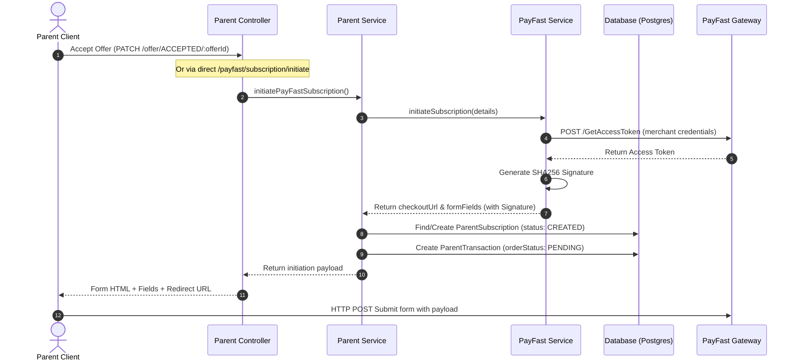
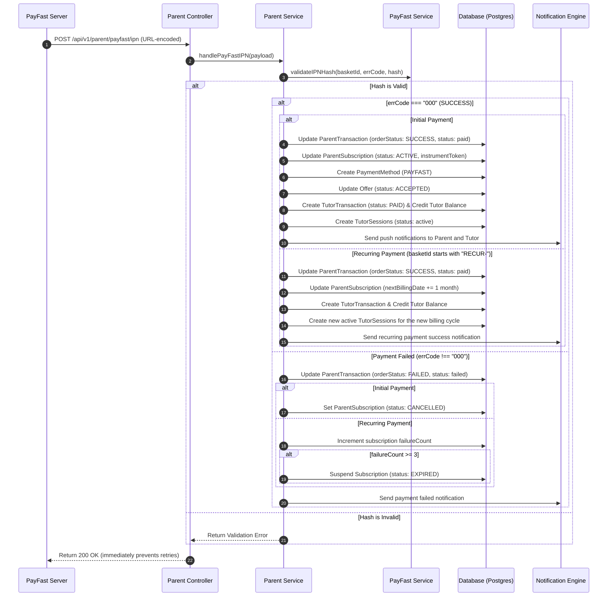
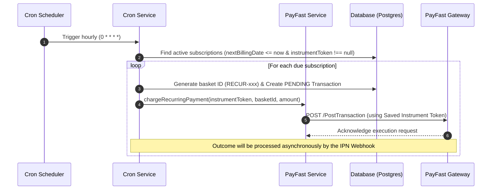

# PayFast Payment Integration Working Flow

This document details the architecture, request life cycle, database design, and cron jobs for the PayFast subscription payment system in the `ustaad-parent` service.

---

## 🗺️ Architectural Overview

The system manages recurring payments (subscriptions) using PayFast's tokenized transaction APIs. The setup facilitates:
1. **Initial Subscription Initiation:** Collecting user credentials and generating secure checksum signatures to redirect parents to PayFast's payment gateway.
2. **Instant Payment Notification (IPN / Webhook):** Receiving server-to-server posts from PayFast to finalize transaction statuses, activate subscriptions, and secure tokens.
3. **Automated Recurring Billing:** Using a scheduler (cron job) to periodically charge parents using saved tokens.

---

## 🔄 Core Execution Flows

### 1. Subscription Initiation Flow
When a parent accepts a tutor's offer, a subscription is initiated.

### 2. IPN Callback Handling (Webhook)
Once the parent executes the payment, PayFast calls the backend endpoint server-to-server.

### 3. Hourly Recurring Billing (Cron Job)
A cron job executes periodically to capture due payments using tokenized cards.

---

## 🗄️ Database Schema Entities & Mappings

The following tables and attributes support this workflow:

### 1. `ParentSubscription`
Tracks the lifecycle of the parent's subscription plan.
* `basketId` (string): The unique identifier generated for the transaction (e.g. `SUB-timestamp-rand` or `RECUR-timestamp-rand`).
* `instrumentToken` (string): Secured token stored from PayFast for authorizing subsequent recurring charges.
* `status` (enum): `CREATED`, `ACTIVE`, `CANCELLED`, `EXPIRED`.
* `nextBillingDate` (timestamp): Next billing day. Advanced by 1 month upon successful payment.
* `lastPaymentDate` (timestamp): When the last transaction succeeded.
* `lastPaymentAmount` (decimal): Real value processed.
* `failureCount` (integer): Tracked attempts. Increments on error, suspends user to `EXPIRED` if values reach $\ge 3$.

### 2. `ParentTransaction`
Logs checkout bills.
* `basketId` (string): Correlates transactions to subscriptions.
* `orderStatus` (enum): `PENDING`, `SUCCESS`, or `FAILED`.
* `status` (enum): `created`, `paid`, `failed`.
* `invoiceId` (string): Mapped to PayFast transaction reference after callback.

### 3. `PaymentMethod`
Saves authorized cards.
* `instrumentToken` (string): Used for tokenized charges.
* `paymentProvider` (string): Identifies `PAYFAST` or `STRIPE`.

---

## 📦 Key Component Reference

### 1. [`payfast.service.ts`](file:///Users/hamza/Downloads/work/ustad-app/ustaad-parent/src/services/payfast.service.ts)
* Low-level API adapter.
* Handles SHA256 checksum creation (`generateSignature`) and webhook validation (`validateIPNHash`).
* Implements direct HTTP requests to retrieve session tokens (`GetAccessToken` / `token`) and charge cards (`PostTransaction` / `transaction/recurring`).

### 2. [`parent.service.ts`](file:///Users/hamza/Downloads/work/ustad-app/ustaad-parent/src/modules/parent/parent.service.ts)
* High-level business logic processor.
* Implements `initiatePayFastSubscription()` to create records and setup payment variables.
* Implements `handlePayFastIPN()` to parse incoming webhook fields and delegate logic to `handleInitialPaymentIPN()` or `handleRecurringPaymentIPN()`.

### 3. [`cron.service.ts`](file:///Users/hamza/Downloads/work/ustad-app/ustaad-parent/src/services/cron.service.ts)
* Orchestrates background execution.
* Finds overdue active subscriptions using `processRecurringPayments()`.
* Calls `chargeRecurringSubscription()` to spawn automated transactions.
